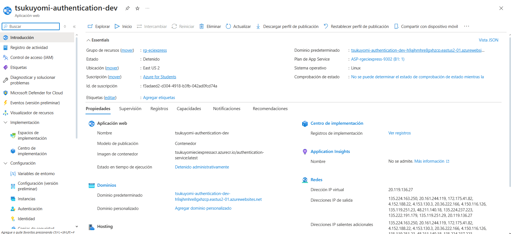
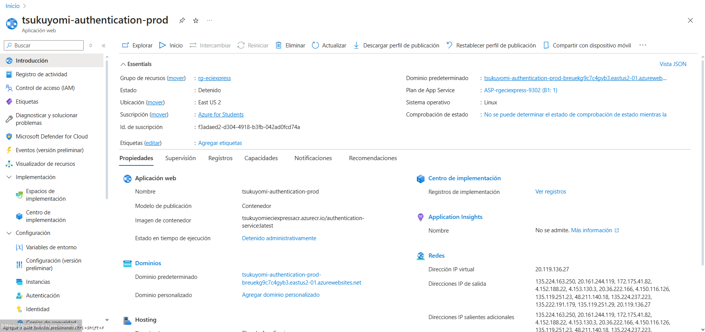

<div align="center">

# 📚 ECIEXPRESS — Sistema de Autenticación Backend

### *"Sin filas, sin estrés, ECIEXPRESS"*

---

### 🛠️ Stack Tecnológico


### ☁️ Infraestructura & Calidad


### 🏗️ Arquitectura


</div>

---

## 📑 Tabla de Contenidos

1. [👤 Integrantes](#1--integrantes)
2. [🎯 Objetivo del Proyecto](#2--objetivo-del-proyecto)
3. [⚡ Funcionalidades Principales](#3--funcionalidades-principales)
4. [📋 Estrategia de Versionamiento y Branches](#4--manejo-de-estrategia-de-versionamiento-y-branches)
    - [4.1 Convenciones para crear ramas](#41-convenciones-para-crear-ramas)
    - [4.2 Convenciones para crear commits](#42-convenciones-para-crear-commits)
5. [⚙️ Tecnologías Utilizadas](#5--tecnologias-utilizadas)
6. [🧩 Funcionalidad](#6--funcionalidad)
7. [📊 Diagramas](#7--diagramas)
8. [⚠️ Manejo de Errores](#8--manejo-de-errores)
9. [🧪 Evidencia de Pruebas y Ejecución](#9--evidencia-de-las-pruebas-y-como-ejecutarlas)
10. [🗂️ Organización del Código](#10--codigo-de-la-implementacion-organizado-en-las-respectivas-carpetas)
11. [🚀 Ejecución del Proyecto](#11--ejecucion-del-proyecto)
12. [☁️ CI/CD y Despliegue en Azure](#12--evidencia-de-cicd-y-despliegue-en-azure)
13. [🤝 Contribuciones](#13--contribuciones)

---

## 1. 👤 Integrantes:

- Sebastian Ortega
- Nikolas Martinez
- Manuel Guarnizo
- Sofia Ariza

## 2. 🎯 Objetivo del Proyecto

En la actualidad, las cafeterias y papelerias dentro de nuestro campus universitario se presentan serias dificultades
operativas durante las horas pico. Estudiantes, docentes y personal administrativo deben enfrentar largas filas y
esperas prolongadas para adquirir sus alimentos o materiales pedidos, lo que genera gran perdida de tiempo, generando
retrasos a clases, desorganizacon y una mala experiencia tanto para los usuarios como para los trabajadores.

El modelo de atención presencial genera mucha agromelación, errores en pedidos y pagos, poca trazabilidad en las ventas,
generando poca eficiencia operativa. Por lo cual se requiere un sistema digital que optimice los procesos de compra, para
reducir los tiempos de espera y mejorando la experiencia de todos.

---

## 3. ⚡ Funcionalidades principales

- **Autenticación segura con JWT**: Sistema de login con tokens de acceso y refresh tokens para mantener sesiones activas
- **Validación de tokens**: Verificación de la autenticidad y vigencia de los tokens JWT en tiempo real
- **Gestión de sesiones**: Renovación automática de tokens mediante refresh tokens sin requerir nuevo inicio de sesión
- **Integración con microservicios**: Comunicación con el servicio de usuarios a través del API Gateway para validación de credenciales
- **Encriptación de contraseñas**: Uso de BCrypt para el almacenamiento y validación segura de contraseñas
- **Control de acceso basado en roles**: Soporte para diferentes niveles de permisos (ADMIN, SELLER, USER)
- **Eventos de auditoría**: Publicación de eventos de login exitoso mediante Redis para trazabilidad del sistema

---


## 4. 📋 Manejo de Estrategia de versionamiento y branches

### Estrategia de Ramas (Git Flow)

-

### Ramas y propósito
- Manejaremos GitFlow, el modelo de ramificación para el control de versiones de Git

#### `main`
- **Propósito:** rama **estable** con la versión final (lista para demo/producción).
- **Reglas:**
    - Solo recibe merges desde `release/*` y `hotfix/*`.
    - Cada merge a `main` debe crear un **tag** SemVer (`vX.Y.Z`).
    - Rama **protegida**: PR obligatorio, 1–2 aprobaciones, checks de CI en verde.

#### `develop`
- **Propósito:** integración continua de trabajo; base de nuevas funcionalidades.
- **Reglas:**
    - Recibe merges desde `feature/*` y también desde `release/*` al finalizar un release.
    - Rama **protegida** similar a `main`.

#### `feature/*`
- **Propósito:** desarrollo de una funcionalidad, refactor o spike.
- **Base:** `develop`.
- **Cierre:** se fusiona a `develop` mediante **PR**


#### `release/*`
- **Propósito:** congelar cambios para estabilizar pruebas, textos y versiones previas al deploy.
- **Base:** `develop`.
- **Cierre:** merge a `main` (crear **tag** `vX.Y.Z`) **y** merge de vuelta a `develop`.
- **Ejemplo de nombre:**  
  `release/1.3.0`

#### `hotfix/*`
- **Propósito:** corregir un bug **crítico** detectado en `main`.
- **Base:** `main`.
- **Cierre:** merge a `main` (crear **tag** de **PATCH**) **y** merge a `develop` para mantener paridad.
- **Ejemplos de nombre:**  
  `hotfix/fix-blank-screen`, `hotfix/css-broken-header`


---

### 4.1 Convenciones para **crear ramas**

#### `feature/*`
**Formato:**
```
feature/[nombre-funcionalidad]-ECIExpress_[codigo-jira]
```

**Ejemplos:**
- `feature/readme_ECIExpress-34`

**Reglas de nomenclatura:**
- Usar **kebab-case** (palabras separadas por guiones)
- Máximo 50 caracteres en total
- Descripción clara y específica de la funcionalidad
- Código de Jira obligatorio para trazabilidad

#### `release/*`
**Formato:**
```
release/[version]
```
**Ejemplo:** `release/1.3.0`

#### `hotfix/*`
**Formato:**
```
hotfix/[descripcion-breve-del-fix]
```
**Ejemplos:**
- `hotfix/corregir-pantalla-blanca`
- `hotfix/arreglar-header-responsive`

---

### 4.2 Convenciones para **crear commits**

#### **Formato:**
```
[codigo-jira] [tipo]: [descripción específica de la acción]
```

#### **Tipos de commit:**
- `feat`: Nueva funcionalidad
- `fix`: Corrección de errores
- `docs`: Cambios en documentación
- `style`: Cambios de formato/estilo (espacios, punto y coma, etc.)
- `refactor`: Refactorización de código sin cambios funcionales
- `test`: Agregar o modificar tests
- `chore`: Tareas de mantenimiento, configuración, dependencias

#### **Ejemplos de commits específicos:**
```bash
# ✅ BUENOS EJEMPLOS
git commit -m "26-feat: agregar validación de email en formulario login"
git commit -m "24-fix: corregir error de navegación en header mobile"


# ❌ EVITAR 
git commit -m "23-feat: agregar login"
git commit -m "24-fix: arreglar bug"

```

#### **Reglas para commits específicos:**
1. **Un commit = Una acción específica**: Cada commit debe representar un cambio lógico y completo
2. **Máximo 72 caracteres**: Para que sea legible en todas las herramientas Git
3. **Usar imperativo**: "agregar", "corregir", "actualizar" (no "agregado", "corrigiendo")
4. **Ser descriptivo**: Especificar QUÉ se cambió y DÓNDE
5. **Commits frecuentes**: Mejor muchos commits pequeños que pocos grandes

#### **Beneficios de commits específicos:**
- 🔄 **Rollback preciso**: Poder revertir solo la parte problemática
- 🔍 **Debugging eficiente**: Identificar rápidamente cuándo se introdujo un bug
- 📖 **Historial legible**: Entender la evolución del código
- 🤝 **Colaboración mejorada**: Reviews más fáciles y claras


---


## 5. ⚙️Tecnologías utilizadas

El backend del sistema ECIExpress fue desarrollado con una arquitectura basada en **Spring Boot** y componentes del
ecosistema **Java**, garantizando modularidad, mantenibilidad, seguridad y facilidad de despliegue. A continuación se
detallan las principales tecnologías empleadas en el proyecto:

| **Tecnología / Herramienta** | **Versión / Framework** | **Uso principal en el proyecto** |
|------------------------------|--------------------------|----------------------------------|
| **Java OpenJDK** | 17 | Lenguaje de programación base del backend, orientado a objetos y multiplataforma. |
| **Spring Boot** | 3.x | Framework principal para la creación del API REST, manejo de dependencias e inyección de componentes. |
| **Spring Web** | — | Implementación del modelo MVC y exposición de endpoints REST. |
| **Spring Security** | — | Configuración de autenticación y autorización de usuarios mediante roles y validación de credenciales. |
| **Spring Data MongoDB** | — | Integración con la base de datos NoSQL MongoDB mediante el patrón Repository. |
| **MongoDB Atlas** | 6.x | Base de datos NoSQL en la nube utilizada para almacenar las entidades del sistema. |
| **Apache Maven** | 3.9.x | Gestión de dependencias, empaquetado del proyecto y automatización de builds. |
| **Lombok** | — | Reducción de código repetitivo con anotaciones como `@Getter`, `@Setter`, `@Builder` y `@AllArgsConstructor`. |
| **JUnit 5** | — | Framework para pruebas unitarias que garantiza el correcto funcionamiento de los servicios. |
| **Mockito** | — | Simulación de dependencias para pruebas unitarias sin requerir acceso a la base de datos real. |
| **JaCoCo** | — | Generación de reportes de cobertura de código para evaluar la efectividad de las pruebas. |
| **SonarQube** | — | Análisis estático del código fuente y control de calidad para detectar vulnerabilidades y malas prácticas. |
| **Swagger (OpenAPI 3)** | — | Generación automática de documentación y prueba interactiva de los endpoints REST. |
| **Postman** | — | Entorno de pruebas de la API, utilizado para validar respuestas en formato JSON con los métodos `POST`, `GET`, `PATCH` y `DELETE`. |
| **Docker** | — | Contenerización del servicio para garantizar despliegues consistentes en distintos entornos. |
| **Azure App Service** | — | Entorno de ejecución en la nube para el despliegue automático del backend. |
| **Azure DevOps** | — | Plataforma para la gestión ágil del proyecto, seguimiento de tareas y control de versiones. |
| **GitHub Actions** | — | Configuración de pipelines de integración y despliegue continuo (CI/CD). |
| **SSL / HTTPS** | — | Implementación de certificados digitales para asegurar la comunicación entre cliente y servidor. |

> 🧠 Estas tecnologías fueron seleccionadas para asegurar **escalabilidad**, **modularidad**, **seguridad**, **trazabilidad** y **mantenibilidad** del sistema, aplicando buenas prácticas de ingeniería de software y estándares de desarrollo moderno.


## 6. 🧩 Funcionalidad

El backend implementa un **sistema de autenticación y autorización seguro basado en JWT** que gestiona el acceso de usuarios, vendedores y administradores al ecosistema universitario. El sistema proporciona autenticación stateless, gestión de tokens, validación de credenciales y control de acceso basado en roles.

---

### 🔑 Funcionalidades principales

#### 1️⃣ **Autenticación de Usuarios**

El sistema permite a los usuarios iniciar sesión de forma segura mediante credenciales validadas con el servicio de usuarios a través del API Gateway.

| **Funcionalidad** | **Endpoint** | **Método HTTP** | **Descripción** |
|-------------------|--------------|-----------------|-----------------|
| **Iniciar sesión** | `/auth/login` | `POST` | Autentica usuarios con email y contraseña, retorna tokens JWT |
| **Validar token** | `/auth/validate` | `GET` | Verifica si un token JWT es válido y no ha expirado |
| **Extraer username** | `/auth/extract-username` | `GET` | Obtiene el email del usuario desde un token JWT |
| **Renovar token** | `/auth/refresh` | `POST` | Genera nuevos tokens de acceso usando un refresh token válido |
| **Información del usuario autenticado** | `/auth/me` | `GET` | Obtiene los datos del usuario actual autenticado |

**Ejemplo de uso:**

`POST /auth/login`
```json
{
  "email": "estudiante@mail.escuelaing.edu.co",
  "password": "securePassword123"
}
```

**Respuesta exitosa:**
```json
{
  "accessToken": "eyJhbGciOiJIUzI1NiIsInR5cCI6IkpXVCJ9...",
  "refreshToken": "eyJhbGciOiJIUzI1NiIsInR5cCI6IkpXVCJ9...",
  "tokenType": "Bearer",
  "expiresIn": 3600,
  "user": {
    "userId": "user-123",
    "email": "estudiante@mail.escuelaing.edu.co",
    "role": "USER",
    "pfpURL": "https://example.com/avatar.jpg"
  }
}
```

---

#### 2️⃣ **Gestión de Tokens JWT**

El sistema utiliza **JSON Web Tokens (JWT)** con algoritmo **HS256** para mantener sesiones seguras sin necesidad de almacenar estado en el servidor.

| **Componente** | **Duración** | **Propósito** | **Claims incluidos** |
|----------------|--------------|---------------|----------------------|
| **Access Token** | 1 hora | Autenticar peticiones a servicios protegidos | `userId`, `email`, `role`, `exp`, `iat` |
| **Refresh Token** | 7 días | Renovar access tokens sin requerir login | `userId`, `email`, `role`, `type`, `exp`, `iat` |

**Estructura de un JWT:**
```
Header:  { "alg": "HS256", "typ": "JWT" }
Payload: { "userId": "123", "email": "user@mail.com", "role": "USER", "exp": 1735819200 }
Signature: HMACSHA256(base64UrlEncode(header) + "." + base64UrlEncode(payload), secret)
```

**Flujo de autenticación con tokens:**
1. Usuario envía credenciales → `POST /auth/login`
2. Backend valida con User Service vía API Gateway
3. Backend genera Access Token + Refresh Token
4. Cliente almacena tokens (localStorage o cookies seguras)
5. Cliente incluye Access Token en header: `Authorization: Bearer <token>`
6. Cuando Access Token expira → usar Refresh Token en `POST /auth/refresh`
7. Si Refresh Token expira → requerir nuevo login

---

#### 3️⃣ **Validación de Credenciales y Seguridad**

El sistema implementa múltiples capas de seguridad para proteger la autenticación.

| **Mecanismo de Seguridad** | **Implementación** | **Propósito** |
|----------------------------|-------------------|---------------|
| **Encriptación de contraseñas** | BCrypt con salt | Almacenamiento seguro de contraseñas |
| **Validación de formato de email** | Regex pattern | Prevenir inyecciones y errores de formato |
| **Tokens firmados** | HMAC SHA-256 | Garantizar integridad y autenticidad |
| **Validación de expiración** | Claims `exp` y `iat` | Prevenir uso de tokens vencidos |
| **CORS configurado** | Spring Security | Permitir solo orígenes autorizados |
| **HTTPS obligatorio** | Producción en Azure | Encriptar comunicación cliente-servidor |

**Validación de contraseñas con BCrypt:**
```java
// Al hacer login
boolean passwordMatches = passwordEncoder.matches(
    loginDTO.password(),      // Contraseña en texto plano
    user.password()           // Hash almacenado en BD
);
```

**Validación de tokens:**
```java
//     Verificar firma, expiración e integridad
// Jwts.parserBuilder()
//    .setSigningKey(getSigningKey())
//    .build()
//    .parseClaimsJws(token);   Lanza excepción si es inválido
```

---

#### 4️⃣ **Control de Acceso Basado en Roles (RBAC)**

El sistema implementa autorización mediante roles definidos en el enum `Role`.

| **Rol** | **Permisos** | **Casos de uso** |
|---------|--------------|------------------|
| **ADMIN** | Acceso total al sistema | Gestión de usuarios, configuración, reportes |
| **SELLER** | Gestión de productos y pedidos | Crear productos, responder consultas, gestionar inventario |
| **USER** | Consulta y compra de productos | Realizar pedidos, enviar mensajes, ver catálogo |

**Protección de endpoints con roles:**
```java
@GetMapping("/auth/me")
@PreAuthorize("isAuthenticated()")  // Requiere estar autenticado
public ResponseEntity<UserInfoDto> getCurrentUser(Authentication authentication) {
    // Solo usuarios con token válido pueden acceder
}

// En otros servicios se puede usar:
// @PreAuthorize("hasRole('ADMIN')")
// @PreAuthorize("hasAnyRole('SELLER', 'ADMIN')")

```

**Extracción de rol desde token:**
```java
String token = request.getHeader("Authorization").substring(7);
Role userRole = jwtUtil.extractRole(token);
// Validar permisos según el rol extraído
```

---

#### 5️⃣ **Integración con Microservicios**

El servicio de autenticación se comunica con otros microservicios del ecosistema ECIExpress.

| **Servicio Destino** | **Propósito** | **Comunicación** | **URL** |
|---------------------|---------------|------------------|---------|
| **User Service** | Validar credenciales y obtener datos de usuario | REST API via Gateway | `https://api-gateway-despliegue.onrender.com/users` |
| **API Gateway** | Punto de entrada unificado | HTTP REST | `https://api-gateway-despliegue.onrender.com` |
| **Redis Pub/Sub** | Publicar eventos de auditoría | Redis Messaging | Canal: `events.login.success` |

**Flujo de comunicación:**
```
Cliente → Auth Service → API Gateway → User Service → MongoDB
                ↓
            Redis Pub/Sub → Notification Service (suscriptor)
```

**Ejemplo de cliente HTTP interno:**
```java
@Service
public class UserServiceClient {
    private final RestTemplate restTemplate;
    private final String userServiceUrl = "https://api-gateway-despliegue.onrender.com/users";
    
    public Optional<UserCredentialsDto> getUserByEmail(String email) {
        String url = userServiceUrl + "/credentials/" + email;
        ResponseEntity<UserCredentialsDto> response = 
            restTemplate.getForEntity(url, UserCredentialsDto.class);
        return Optional.ofNullable(response.getBody());
    }
}
```

---

#### 6️⃣ **Eventos de Auditoría con Redis**

El sistema publica eventos de autenticación para trazabilidad y análisis de seguridad.

| **Evento** | **Topic Redis** | **Datos incluidos** | **Uso** |
|-----------|----------------|---------------------|---------|
| **Login exitoso** | `events.login.success` | `userId`, `email`, `name`, `ip`, `timestamp` | Auditoría, detección de anomalías, estadísticas |

**Estructura de evento publicado:**
```json
{
  "eventId": "a7b3c8d2-4e9f-11ec-81d3-0242ac130003",
  "eventType": "login.success",
  "timestamp": "2025-12-02T14:30:00Z",
  "version": "1.0",
  "data": {
    "email": "estudiante@mail.escuelaing.edu.co",
    "userId": "user-123",
    "name": "estudiante",
    "ip": "192.168.1.10",
    "userAgent": "Web"
  }
}
```

**Servicios que pueden suscribirse:**
- 📧 **Notification Service**: Enviar email de notificación de acceso
- 📊 **Analytics Service**: Registrar métricas de uso
- 🔒 **Security Service**: Detectar intentos de acceso sospechosos

---

### 🔐 Filtros de Seguridad

El sistema implementa un **filtro JWT personalizado** que intercepta todas las peticiones HTTP.

| **Componente** | **Orden de ejecución** | **Responsabilidad** |
|----------------|------------------------|---------------------|
| **JwtAuthenticationFilter** | Antes de `UsernamePasswordAuthenticationFilter` | Extraer y validar token JWT de headers |
| **SecurityConfig** | Configuración inicial | Definir rutas públicas y protegidas |
| **@PreAuthorize** | En métodos de controlador | Validación de roles específicos |

**Flujo del filtro JWT:**
```
1. Cliente envía petición con header: Authorization: Bearer <token>
2. JwtAuthenticationFilter intercepta la petición
3. Extrae token del header "Authorization"
4. Valida firma, expiración e integridad del token
5. Si es válido → Crea Authentication y lo agrega al SecurityContext
6. Si es inválido → Rechaza petición con 401 Unauthorized
7. Continúa con el siguiente filtro o controlador
```

**Rutas públicas (sin autenticación):**
- `/auth/login` - Inicio de sesión
- `/auth/validate` - Validación de tokens
- `/auth/refresh` - Renovación de tokens
- `/auth/extract-username` - Extracción de email
- `/swagger-ui/**` - Documentación API
- `/actuator/health` - Health checks

**Rutas protegidas (requieren autenticación):**
- `/auth/me` - Información del usuario autenticado
- Todas las demás rutas del sistema por defecto

---

### 📡 Arquitectura de Comunicación

El sistema implementa múltiples protocolos de comunicación:

| **Protocolo** | **Uso** | **Ventajas** | **Endpoints** |
|---------------|---------|--------------|---------------|
| **REST API** | Autenticación y validación de tokens | Stateless, cacheable, estándar HTTP | `/auth/*` |
| **Redis Pub/Sub** | Eventos de auditoría asíncronos | Desacoplamiento, escalabilidad | `events.*` |
| **HTTP Client** | Comunicación con User Service | Integración sincrónica con microservicios | Interno |

**Diagrama de flujo:**
```
Cliente Frontend
     ↓ (HTTPS/REST)
Authentication Service
     ↓ (HTTP/REST)
API Gateway
     ↓ (HTTP/REST)
User Service → MongoDB
     ↑
Authentication Service
     ↓ (Redis Pub/Sub)
Notification/Analytics Services
```

---

### ✨ Casos de Uso Implementados

| **Caso de Uso** | **Actor** | **Descripción** | **Endpoint** |
|-----------------|-----------|-----------------|--------------|
| **Iniciar sesión como usuario** | Usuario | Autenticarse con email y contraseña | `POST /auth/login` |
| **Iniciar sesión como vendedor** | Vendedor | Autenticarse para gestionar productos | `POST /auth/login` |
| **Iniciar sesión como administrador** | Admin | Acceder al panel de administración | `POST /auth/login` |
| **Validar token en servicios** | Microservicio | Verificar autenticidad de un token JWT | `GET /auth/validate` |
| **Renovar sesión expirada** | Usuario/Vendedor | Obtener nuevo access token sin re-login | `POST /auth/refresh` |
| **Obtener información del usuario** | Frontend | Consultar datos del usuario autenticado | `GET /auth/me` |
| **Extraer email de token** | Gateway/Servicios | Identificar usuario desde token | `GET /auth/extract-username` |
| **Auditar accesos al sistema** | Sistema | Registrar eventos de login para seguridad | Redis Event |

---

### 🎯 Beneficios de las Funcionalidades

| **Beneficio** | **Impacto** |
|---------------|-------------|
| 🔒 **Seguridad robusta** | Protección con BCrypt, JWT firmados y validación multicapa |
| ⚡ **Stateless y escalable** | No requiere sesiones en servidor, fácil de escalar horizontalmente |
| 🔄 **Renovación automática** | Refresh tokens permiten mantener sesión sin interrupciones |
| 🎭 **Control de acceso granular** | RBAC permite permisos específicos por rol |
| 🔗 **Integración fluida** | Comunicación estandarizada con otros microservicios |
| 📊 **Trazabilidad completa** | Eventos de Redis permiten auditoría y análisis de seguridad |
| 🌐 **Compatible con múltiples clientes** | Funciona con Web, Mobile y otros servicios backend |
| 🛡️ **Protección contra ataques** | Previene CSRF, XSS, inyección SQL y replay attacks |

---

### 🧪 Validaciones Implementadas

El sistema implementa validaciones exhaustivas en todos los niveles:

| **Nivel** | **Validaciones** | **Herramienta** |
|-----------|------------------|-----------------|
| **DTO** | Email formato válido, campos no nulos/vacíos | `@Valid`, `@NotBlank`, `@Email` |
| **Servicio** | Formato de email, existencia de usuario, contraseña correcta | Lógica de negocio |
| **Token** | Firma válida, no expirado, estructura correcta | `JwtUtil` + JJWT library |
| **Roles** | Permisos adecuados para la operación | `@PreAuthorize` |

**Ejemplo de validación en DTO:**
```java
public record LogInDTO(
    @NotBlank(message = "El email no puede estar vacío")
    @Email(message = "El formato del email es inválido")
    String email,
    
    @NotBlank(message = "La contraseña no puede estar vacía")
    @Size(min = 6, message = "La contraseña debe tener al menos 6 caracteres")
    String password
) {}
```

---

> 💡 Gracias a esta arquitectura, el **Authentication Service** de ECIExpress garantiza un sistema de autenticación **seguro**, **escalable**, **auditable** y **compatible** con los estándares modernos de desarrollo, proporcionando una base sólida para todo el ecosistema de microservicios.


## 7. 📊 Diagramas


## 8. ⚠️ Manejo de Errores

El backend de **ECIExpress** implementa un **mecanismo centralizado de manejo de errores** que garantiza uniformidad, claridad y seguridad en todas las respuestas enviadas al cliente cuando ocurre un fallo.

Este sistema permite mantener una comunicación clara entre el backend y el frontend, asegurando que los mensajes de error sean legibles, útiles y coherentes, sin exponer información sensible del servidor.

---

### 🧠 Estrategia general de manejo de errores

El sistema utiliza una **clase global** que intercepta todas las excepciones lanzadas desde los controladores REST.  
A través de la anotación `@ControllerAdvice`, se centraliza el manejo de errores, evitando el uso repetitivo de bloques `try-catch` en cada endpoint.

Cada error se transforma en una respuesta **JSON estandarizada**, que mantiene un formato uniforme para todos los tipos de fallos.

**📋 Estructura del mensaje de error:**

```json
{
  "timestamp": "2025-11-10T10:30:00Z",
  "status": 404,
  "error": "Not Found",
  "message": "Usuario no encontrado.",
  "path": "/api/credentials/{email}"
}
```

---

### ⚙️ Global Exception Handler

El **Global Exception Handler** es una clase con la anotación `@ControllerAdvice` que captura y maneja todas las excepciones del sistema.  
Utiliza métodos con `@ExceptionHandler` para procesar errores específicos y devolver una respuesta personalizada acorde al tipo de excepción.

**✨ Características principales:**

- ✅ **Centraliza** la captura de excepciones desde todos los controladores
- ✅ **Retorna mensajes JSON consistentes** con el mismo formato estructurado
- ✅ **Asigna códigos HTTP** según la naturaleza del error (400, 404, 409, 500, etc.)
- ✅ **Define mensajes descriptivos** que ayudan tanto al desarrollador como al usuario
- ✅ **Mantiene la aplicación limpia**, eliminando bloques try-catch redundantes
- ✅ **Mejora la trazabilidad** y facilita la depuración en los entornos de prueba y producción

**🔄 Ejemplo conceptual de funcionamiento:**

Cuando se lanza una excepción del tipo `EntityNotFoundException`, el handler la intercepta y genera automáticamente una respuesta como:

```json
{
  "status": 404,
  "error": "Not Found",
  "message": "Usuario no encontrado.",
  "path": "/api/credentials/{email}"
}
```

---

### 🧩 Validaciones en DTOs

Además del manejo global de errores, el sistema utiliza **validaciones automáticas** sobre los DTOs (Data Transfer Objects) para garantizar que los datos que llegan al servidor cumplan con las reglas de negocio antes de ejecutar cualquier lógica.

Estas validaciones se implementan mediante las anotaciones de **Javax Validation** y **Hibernate Validator**, como `@NotBlank`, `@NotNull`, `@Email`, `@Min`, `@Max`, entre otras.

**📝 Ejemplo de DTO con validaciones:**

```java

```

Si alguno de los campos no cumple las validaciones, se lanza automáticamente una excepción del tipo `MethodArgumentNotValidException`.  
Esta es capturada por el **Global Exception Handler**, que devuelve una respuesta JSON estandarizada con el detalle del campo inválido.

**⚠️ Ejemplo de respuesta ante error de validación:**

```json
{
  "status": 400,
  "error": "Bad Request",
  "message": "El campo 'email' debe tener un formato válido."
}
```

> 💡 Gracias a este mecanismo, se asegura que las peticiones erróneas sean detectadas desde el inicio, reduciendo fallos en capas más profundas como servicios o repositorios.

---

### 📊 Tipos de errores manejados

La siguiente tabla resume los principales tipos de excepciones manejadas en el sistema, junto con su respectivo código HTTP y un ejemplo de mensaje retornado:

| **Excepción** | **Código HTTP** | **Descripción del error** | **Ejemplo de mensaje** |
|---------------|-----------------|---------------------------|------------------------|
| `IllegalArgumentException` | `400 Bad Request` | Parámetros inválidos o peticiones mal estructuradas | *"El parámetro no puede ser nulo."* |
| `MethodArgumentNotValidException` | `400 Bad Request` | Error de validación en un DTO o parámetro de entrada | *"email: El email no puede estar vacío, password: La contraseña no puede estar vacía"* |
| `ConstraintViolationException` | `400 Bad Request` | Violación de restricciones de validación | *"email: El formato del email es inválido"* |
| `HttpMessageNotReadableException` | `400 Bad Request` | JSON mal formado o no legible | *"JSON mal formado: Unexpected character..."* |
| `BusinessException` | `400 Bad Request` | Violación de reglas de negocio | *"La operación no cumple con las reglas de negocio establecidas"* |
| `AuthenticationException` | | **Agrupa errores de autenticación:** | |
| └─ `AuthenticationException("Invalid credentials")` | `401 Unauthorized` | Credenciales incorrectas (email o contraseña) | *"Invalid credentials"* |
| └─ `AuthenticationException("Invalid email format")` | `401 Unauthorized` | Formato de email inválido durante login | *"Invalid email format"* |
| └─ `AuthenticationException("Invalid token")` | `401 Unauthorized` | Token JWT inválido, expirado o manipulado | *"Invalid token"* |
| `ResourceNotFoundException` | `404 Not Found` | Usuario o recurso solicitado no existe | *"User not found with email: user@example.com"* |
| `ResourceAlreadyExistsException` | `409 Conflict` | Intento de crear un recurso que ya existe | *"El usuario ya existe en el sistema"* |
| `DataIntegrityViolationException` | `409 Conflict` | Violación de integridad de datos (claves duplicadas) | *"Error de integridad de datos: Duplicate key"* |
| `ServiceUnavailableException` | `503 Service Unavailable` | Servicio externo no disponible (User Service, Redis) | *"El servicio de usuarios no está disponible"* |
| `ValidationException` | `422 Unprocessable Entity` | Error de validación general | *"Los datos proporcionados no son válidos"* |
| `Exception` | `500 Internal Server Error` | Error interno no controlado del servidor | *"Error inesperado: NullPointerException..."* |

---

### ✅ Beneficios del manejo centralizado

| **Beneficio** | **Descripción** |
|---------------|-----------------|
| 🎯 **Uniformidad** | Todas las respuestas de error tienen el mismo formato JSON |
| 🔧 **Mantenibilidad** | Agregar nuevas excepciones no requiere modificar cada controlador |
| 🔒 **Seguridad** | Oculta los detalles internos del servidor y evita exponer trazas del sistema |
| 📍 **Trazabilidad** | Cada error incluye información contextual (ruta y hora exacta) |
| 🤝 **Integración fluida** | Facilita la comunicación con el frontend y herramientas como Postman o Swagger |

---

> Gracias a este enfoque, el backend de ECIExpress logra un manejo de errores **robusto**, **escalable** y **seguro**, garantizando una experiencia de usuario más confiable y profesional.

---


---

## 9. 🧪 Evidencia de las pruebas y cómo ejecutarlas


## 10. 🗂️ Código de la implementación organizado en las respectivas carpetas

El proyecto sigue e una **arquitectura en capas tradicional de Spring Boot** que separa las responsabilidades en capas bien definidas, promoviendo la escalabilidad, testabilidad y mantenibilidad del código.

---

### 📂 Estructura general del proyecto (Scaffolding)

```
TSUKUYOMI-AuthenticationService-Backend/
│
├── 📁 src/
│   ├── 📁 main/
│   │   ├── 📁 java/edu/dosw/
│   │   │   ├── 📄 Application.java              # Clase principal de Spring Boot
│   │   │   │
│   │   │   ├── 📁 config/                       # 🔧 Configuración
│   │   │   │
│   │   │   ├── 📁 controller/                   # 🌐 Capa de Presentación
│   │   │   │
│   │   │   ├── 📁 dto/                          # 📦 Data Transfer Objects
│   │   │   │
│   │   │   ├── 📁 services/                     # 💼 Capa de Lógica de Negocio
│   │   │   │
│   │   │   ├── 📁 utils/                        # 🛠️ Utilidades
│   │   │   │
│   │   │   ├── 📁 model/                        # 📊 Modelos de Dominio
│   │   │   │   └── 📁 enums/                    # Enumeraciones
│   │   │   │
│   │   │   └── 📁 exception/                    # ⚠️ Manejo de Excepciones
│   │   │
│   │   └── 📁 resources/
│   │       ├── application.properties           # Configuración para desarrollo local
│   │       └── application-docker.properties    # Configuración para Docker/producción

```

---

### 🏛️ Arquitectura en Capas

El proyecto implementa una **arquitectura en capas tradicional de Spring Boot** con separación clara de responsabilidades:

| **Capa** | **Responsabilidad** | **Dependencias** | **Paquetes** |
|----------|---------------------|------------------|--------------|
| **🌐 Presentación** | Exponer endpoints REST y manejar peticiones HTTP | Service, DTO | `controller/` |
| **💼 Lógica de Negocio** | Implementar casos de uso y reglas de autenticación | Utils, Model, Exception, External Services | `services/` |
| **📦 Transfer Objects** | Definir contratos de entrada/salida de datos | Ninguna | `dto/` |
| **📊 Dominio** | Definir entidades y enumeraciones del negocio | Ninguna | `model/` |
| **🛠️ Utilidades** | Funciones auxiliares (JWT, validaciones) | Model | `utils/` |
| **🔧 Configuración** | Configurar seguridad, Redis, HTTP clients, filtros | Security, Utils | `config/` |
| **⚠️ Excepciones** | Manejo centralizado de errores y excepciones custom | DTO | `exception/` |

**Flujo de dependencias:** 
```
Controller → Service → Utils/Model
                ↓
            External Services (API Gateway, Redis)
```

---

### 📋 Detalle de las capas principales

#### 🌐 **Capa de Presentación (controller/)**

Responsable de exponer la API REST y manejar las peticiones HTTP.

```
📁 controller/
└── AuthController
    ├── POST   /auth/login              # Iniciar sesión
    ├── GET    /auth/validate           # Validar token
    ├── GET    /auth/extract-username   # Extraer email del token
    ├── POST   /auth/refresh            # Renovar tokens
    └── GET    /auth/me                 # Información del usuario autenticado
```

**Responsabilidades:**
- ✅ Validar datos de entrada con `@Valid`
- ✅ Delegar lógica de negocio a los servicios
- ✅ Transformar respuestas a DTOs
- ✅ Aplicar seguridad con `@PreAuthorize`

---

#### 💼 **Capa de Lógica de Negocio (services/)**

Contiene la lógica de autenticación, validación y comunicación con servicios externos.

```
📁 services/
├── AuthenticationService       # Core del servicio de autenticación
│   ├── logIn()                 # Autenticar usuario con credenciales
│   ├── validateToken()         # Validar JWT
│   ├── refreshToken()          # Renovar access token
│   ├── extractUsernameFromToken()  # Extraer email del token
│   └── getUserInfo()           # Obtener información del usuario
│
├── UserServiceClient           # Cliente HTTP para User Service
│   └── getUserByEmail()        # Consultar usuario vía API Gateway
│
└── EventPublisherService       # Publicador de eventos a Redis
    └── publishLoginSuccess()   # Publicar evento de login exitoso
```

**Responsabilidades:**
- ✅ Implementar casos de uso de autenticación
- ✅ Validar credenciales con User Service
- ✅ Generar y validar tokens JWT
- ✅ Publicar eventos de auditoría
- ✅ Manejar excepciones de negocio

---

#### 📦 **Capa de DTOs (dto/)**

Define los contratos de datos entre cliente y servidor.

```
📁 dto/
├── 📥 DTOs de Entrada:
│   ├── LogInDTO                    # Email y contraseña
│   └── TokenValidationRequest      # Token a validar
│
├── 📤 DTOs de Salida:
│   ├── AuthResponseDto             # Access token, refresh token, user info
│   ├── TokenValidationResponse     # Resultado de validación booleano
│   ├── AccessValidationResponse    # Respuesta de validación de acceso
│   └── UserInfoDto                 # Información del usuario autenticado
│
├── 🔄 DTOs de Integración:
│   └── UserCredentialsDto          # Credenciales desde User Service
│
└── ⚠️ DTOs de Error:
    └── ErrorResponse               # Respuesta estándar de errores
```

**Características:**
- ✅ Uso de **Java Records** para inmutabilidad
- ✅ Validaciones con `@Valid`, `@NotBlank`, `@Email`
- ✅ Documentación con Swagger (`@Schema`)


---

### 🔐 Flujo de una petición

```
1. Cliente → POST /auth/login
         ↓
2. JwtAuthenticationFilter (si aplica)
         ↓
3. AuthController
    ├── Valida DTO con @Valid
    └── Delega a AuthenticationService
         ↓
4. AuthenticationService
    ├── Valida formato de email
    ├── Consulta UserServiceClient → API Gateway → User Service
    ├── Verifica contraseña con BCrypt
    ├── Genera tokens con JwtUtil
    ├── Publica evento con EventPublisherService → Redis
    └── Retorna AuthResponseDto
         ↓
5. AuthController → ResponseEntity<AuthResponseDto>
         ↓
6. Cliente recibe JSON con tokens
```

---

> 💡 Gracias a esta estructura modular, el **Authentication Service** de ECIExpress es **mantenible**, **escalable** y **fácil de testear**, siguiendo las mejores prácticas de Spring Boot y garantizando una base sólida para el ecosistema de microservicios.


## 11. 🚀 Ejecución del Proyecto


## 12. ☁️ Evidencia de CI/CD y Despliegue en Azure

El proyecto implementa un **pipeline completo de CI/CD** utilizando **GitHub Actions** para automatizar el proceso de integración continua, pruebas, análisis de calidad y despliegue en **Azure Cloud**.

---

### 🔄 Pipeline de CI/CD

El proyecto cuenta con **3 workflows automatizados** que se ejecutan en diferentes momentos del ciclo de desarrollo:

| **Workflow** | **Archivo** | **Trigger** | **Propósito** |
|-------------|-------------|-------------|---------------|
| **CI - Tests & Quality** | `ci.yml` | Push/PR a `develop`, `main`, `feature/**` | Ejecutar pruebas, generar cobertura y análisis de SonarQube |
| **CD - Deploy DEV** | `cd_dev.yml` | Push a `develop`, `feature/**` | Desplegar automáticamente al ambiente de desarrollo |
| **CD - Deploy PROD** | `cd_prod.yml` | Push a `main` | Desplegar automáticamente al ambiente de producción |

---

### 🧪 CI - Integración Continua (ci.yml)

Este workflow se ejecuta en cada **push** o **pull request** para garantizar la calidad del código antes de integrar cambios.

**Pasos del pipeline CI:**

1. **Checkout del código** - Descarga el código fuente del repositorio
2. **Setup JDK 17** - Configura el entorno de Java con Eclipse Temurin
3. **Cache de dependencias Maven** - Optimiza tiempos de build reutilizando dependencias
4. **Levantar Redis (servicio)** - Inicia una instancia de Redis para las pruebas de eventos
5. **Build + Test + Coverage** - Ejecuta `mvn clean verify` para compilar, probar y generar cobertura
6. **Análisis SonarQube** - Envía métricas de calidad de código a SonarCloud/SonarQube
7. **Publicar reporte JaCoCo** - Sube el reporte HTML de cobertura como artefacto

**Fragmento del workflow CI:**

```yaml
- name: Build + Test + Coverage
  run: mvn -B clean verify
  env:
    SPRING_PROFILES_ACTIVE: test
    REDIS_HOST: localhost
    REDIS_PORT: 6379

- name: SonarQube Analysis
  run: mvn -B sonar:sonar
  env:
    SONAR_TOKEN: ${{ secrets.SONAR_TOKEN }}
    SONAR_HOST_URL: ${{ secrets.SONAR_HOST_URL }}
```

**Beneficios:**
- ✅ Detección temprana de errores antes de fusionar cambios
- ✅ Garantiza que todas las pruebas pasen antes del despliegue
- ✅ Métricas de calidad de código (code smells, bugs, vulnerabilidades)
- ✅ Reporte de cobertura de código disponible en cada build

---

### 🚀 CD - Despliegue Continuo (cd_dev.yml / cd_prod.yml)

Estos workflows automatizan el **despliegue** del backend en **Azure Web App** utilizando **Docker** y **Azure Container Registry (ACR)**.

**Pasos del pipeline CD:**

1. **Checkout del código** - Descarga el código fuente
2. **Setup JDK 17** - Configura Java para compilar el proyecto
3. **Build del proyecto Maven** - Ejecuta `mvn clean package -DskipTests` para generar el JAR
4. **Login a Azure Container Registry** - Autenticación con credenciales almacenadas en secrets
5. **Build de la imagen Docker** - Construye la imagen con etiquetas `latest` y hash del commit
6. **Push de la imagen a ACR** - Sube la imagen al registro de contenedores de Azure
7. **Deploy a Azure Web App** - Despliega el contenedor en el App Service correspondiente (DEV o PROD)

**Fragmento del workflow CD:**

```yaml
- name: Build Maven project
  run: mvn clean package -DskipTests

- name: Build Docker image
  run: |
    IMAGE_NAME="${{ secrets.ACR_LOGIN_SERVER }}/auth-service"
    GIT_TAG=${GITHUB_SHA::7}
    docker build -t "$IMAGE_NAME:latest" -t "$IMAGE_NAME:$GIT_TAG" .

- name: Deploy container to Azure Web App
  uses: azure/webapps-deploy@v3
  with:
    app-name: ${{ secrets.AZURE_WEBAPP_NAME_PROD }}
    publish-profile: ${{ secrets.AZURE_WEBAPP_PUBLISH_PROFILE_PROD }}
    images: ${{ secrets.ACR_LOGIN_SERVER }}/auth-service:latest
```

**Estrategia de despliegue:**

- **Desarrollo (`develop`)** → Deploy automático a **Azure Web App (DEV)** → Ambiente de pruebas internas
- **Producción (`main`)** → Deploy automático a **Azure Web App (PROD)** → Ambiente público estable
- **Feature branches** → Deploy a DEV para pruebas antes de fusionar → Validación de funcionalidades

---

### ☁️ Infraestructura en Azure

El backend está desplegado en la nube de **Microsoft Azure** utilizando los siguientes servicios:

| **Servicio de Azure** | **Propósito** | **Configuración** |
|-----------------------|---------------|-------------------|
| **Azure Web App (App Service)** | Hosting del backend Spring Boot en contenedor Docker | Linux, Docker Container, puerto 8082, escalable |
| **Azure Container Registry (ACR)** | Almacenamiento privado de imágenes Docker | Registro privado, integrado con Web App |
| **Azure Redis Cache** (opcional) | Cache distribuido y mensajería Pub/Sub | Standard tier, conexión segura con SSL |
| **Application Insights** (opcional) | Monitoreo y telemetría de la aplicación | Logs, métricas, trazas distribuidas, alertas |

**Arquitectura de despliegue:**

```
GitHub Repository (push)
    ↓
GitHub Actions (CI/CD Pipeline)
    ├── Build JAR (Maven)
    ├── Build Docker Image
    └── Push to ACR
        ↓
Azure Container Registry (ACR)
    ├── auth-service:latest
    └── auth-service:abc1234
        ↓
Azure Web App (App Service)
    ├── Environment: Linux + Docker
    ├── Port: 8082
    └── Variables de entorno configuradas
        ↓
Integración externa:
    ├── API Gateway (Render)
    ├── User Service (vía Gateway)
    └── Redis (Azure Cache o externo)
```

---

### 🐳 Dockerfile del proyecto

El proyecto utiliza un **Dockerfile optimizado** para producción:

```dockerfile
FROM eclipse-temurin:17-jdk
WORKDIR /app
COPY target/*.jar app.jar
EXPOSE 8082
ENTRYPOINT ["java", "-jar", "app.jar"]
```

**Características:**
- ✅ Imagen base oficial de Java 17 (Eclipse Temurin)
- ✅ Lightweight - Solo incluye el JAR compilado
- ✅ Puerto 8082 expuesto (configurable vía variables de entorno)
- ✅ Optimizado para Azure Web App

---

### ⚙️ Variables de entorno en producción

El servicio requiere las siguientes variables de entorno configuradas en Azure Web App:

| **Variable** | **Descripción** | **Ejemplo** |
|-------------|-----------------|-------------|
| `SPRING_PROFILES_ACTIVE` | Perfil de configuración activo | `docker` |
| `JWT_SECRET` | Secret key para firmar tokens JWT | `your-256-bit-secret-key` |
| `JWT_EXPIRATION` | Duración del access token en milisegundos | `3600000` (1 hora) |
| `JWT_REFRESH_EXPIRATION` | Duración del refresh token en milisegundos | `604800000` (7 días) |
| `USER_SERVICE_URL` | URL del API Gateway para User Service | `https://api-gateway-despliegue.onrender.com/users` |
| `REDIS_HOST` | Host del servidor Redis | `redis-server.redis.cache.windows.net` |
| `REDIS_PORT` | Puerto de Redis | `6380` (Azure Redis usa SSL) |
| `REDIS_PASSWORD` | Contraseña de Redis | `your-redis-password` |
| `SERVER_PORT` | Puerto del servidor Spring Boot | `8082` |

---

### 🔐 Secrets y Variables de Entorno

Los siguientes **secrets** están configurados en GitHub para el pipeline CI/CD:

| **Secret** | **Descripción** |
|-----------|-----------------|
| `ACR_LOGIN_SERVER` | URL del Azure Container Registry (ej: `myregistry.azurecr.io`) |
| `ACR_USERNAME` | Usuario de autenticación del ACR |
| `ACR_PASSWORD` | Contraseña del ACR |
| `AZURE_WEBAPP_NAME_DEV` | Nombre del App Service de desarrollo |
| `AZURE_WEBAPP_NAME_PROD` | Nombre del App Service de producción |
| `AZURE_WEBAPP_PUBLISH_PROFILE_DEV` | Perfil de publicación para ambiente DEV |
| `AZURE_WEBAPP_PUBLISH_PROFILE_PROD` | Perfil de publicación para ambiente PROD |
| `SONAR_TOKEN` | Token de autenticación para SonarQube/SonarCloud |

---

### 📊 Evidencias

**Azure Web App - Aplicación desplegada**



---

### ✅ Ventajas del pipeline implementado

- 🚀 **Despliegue automático** - Cada commit a `main` se despliega automáticamente a producción
- 🧪 **Calidad garantizada** - Las pruebas y análisis se ejecutan antes de cada despliegue
- 🔄 **Rollback rápido** - Versionado de imágenes Docker con hash del commit permite revertir cambios
- 📦 **Infraestructura como código** - Todo el pipeline está versionado en Git
- 🔐 **Seguridad** - Credenciales almacenadas de forma segura en GitHub Secrets
- 📊 **Trazabilidad** - Historial completo de despliegues y pruebas en GitHub Actions
- 🐳 **Portabilidad** - El contenedor Docker puede ejecutarse en cualquier plataforma
- 🌐 **Escalabilidad** - Azure Web App permite escalar horizontal y verticalmente según demanda
- 🔍 **Monitoreo** - Application Insights proporciona observabilidad completa del servicio
- 🛡️ **Alta disponibilidad** - Azure garantiza SLA del 99.95% de uptime

---

> 💡 Gracias a este pipeline automatizado, el **Authentication Service** de ECIExpress mantiene **alta calidad**, **despliegues seguros** y **observabilidad completa**, garantizando un servicio confiable y profesional para el ecosistema de microservicios.


## 13. 🤝 Contribuciones

El desarrollo del backend de ECIEXPRESS se realizó aplicando la **metodología ágil Scrum**, promoviendo la colaboración, la mejora continua y la entrega incremental de valor.  
Durante el proceso, el equipo Tsukuyomi trabajó en **sprints semanales**, realizando **revisiones de avance**, **dailies** y **retrospectivas**, lo que permitió mantener una comunicación fluida y adaptarse a los cambios de requisitos en tiempo real.

Cada miembro del equipo asumió un rol dentro del marco de Scrum:

| **Rol Scrum** | **Responsabilidad principal** |
|----------------|-------------------------------|
| **Product Owner** | Definir y priorizar las historias de usuario en el backlog del producto. |
| **Scrum Master** | Asegurar la aplicación de la metodología y eliminar impedimentos. |
| **Developers** | Diseñar, implementar, probar y documentar las funcionalidades. |

**Artefactos y eventos Scrum utilizados:**
- 📋 **Product Backlog:** listado de funcionalidades priorizadas y mantenidas en Jira/GitHub Projects.
- 🧩 **Sprint Backlog:** tareas seleccionadas por sprint según la capacidad del equipo.
- ⚙️ **Daily Scrum:** reuniones cortas de sincronización para identificar bloqueos y avances.
- 📦 **Sprint Review:** revisión de resultados y demostración del incremento funcional.
- 🔄 **Sprint Retrospective:** análisis de mejoras en la dinámica y la comunicación del equipo.

> 💡 Gracias al uso de Scrum, el desarrollo de Tsukuyomi se mantuvo **organizado, transparente y enfocado en la entrega continua de valor**, aplicando principios de autoorganización y aprendizaje colaborativo.

---
### Desarrollado por el equipo Tsukuyomi – DOSW 2025-2

> 💡 **ECIEXPRESS** es un proyecto académico, pero su arquitectura y calidad están pensadas para ser escalables y adaptables a escenarios reales en instituciones educativas.

---


